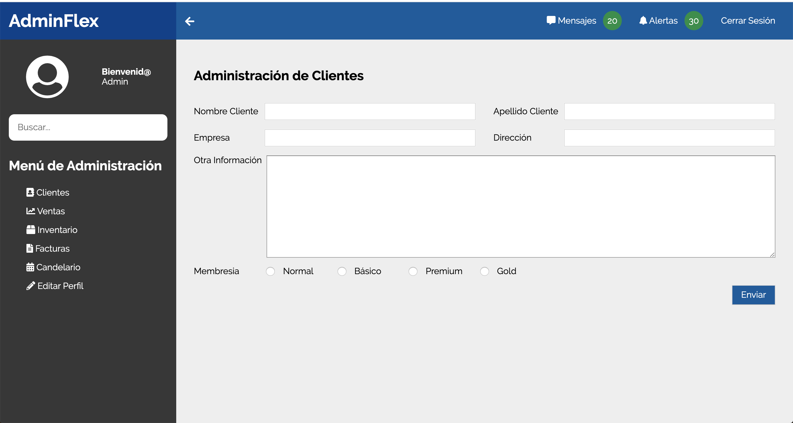

# Flex-Box

This is a practice where I implemented flexbox like layout of the dashboard.

## Run

### Firsts Steps

1. Clone the repository

```shell
    $ git clone ''
    $ cd directory
```

2. Install dependecies.

```shell
    $ npm install
```

*NOTE*

If you need edit the .scss files you should install that:

```shell
    $ npm i gulp-cli -g
```

And run the next comand

```shell
    $ gulp watch 
```

## Preview




